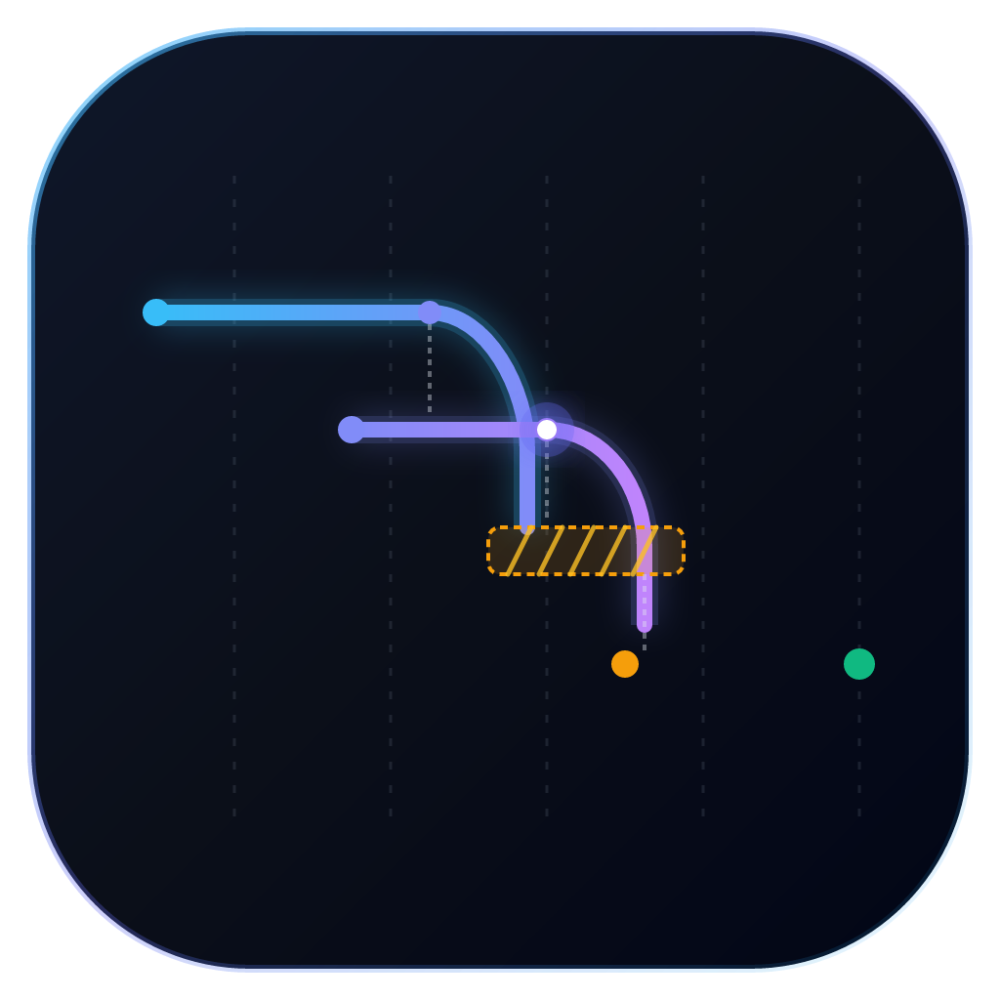

<div align="center">



# TraceWeaver

**Distributed trace correlator and causal event waterfall visualizer with sub-millisecond DuckDB analytics.**

[](https://www.python.org/downloads/)
[](https://fastapi.tiangolo.com)
[](https://duckdb.org)
[](https://textual.textualize.io)
[](LICENSE)

</div>

TraceWeaver correlates distributed traces across asynchronous message boundaries, database outbox tables, and event brokers. When requests transition through Kafka partitions or worker queues, traditional tracing views separate spans into disconnected trees. TraceWeaver stitches these spans into a single causal directed acyclic graph (DAG), measures queue dwell time, flags latency bottlenecks, and displays the execution path through an interactive terminal TUI and a lightweight web dashboard.

## Overview

In microservice environments combining REST endpoints, transactional outbox patterns, and message brokers, measuring end-to-end user latency requires understanding how long messages sit waiting in queues before consumer threads pick them up.

Standard OpenTelemetry spans track synchronous parent-child calls cleanly, but asynchronous boundaries break this relationship. TraceWeaver accepts standard OTLP traces over HTTP (`4318`) and gRPC (`4317`), correlates spans using both hierarchy and trace links, and calculates queue dwell time directly:

```
[S1: Gateway POST /orders (15ms)]
  └── [S2: OrderEngine Process (45ms)]
        └── [S3: Outbox Transaction (5ms)]
              ░░░░░ QUEUE DWELL TIME: 340ms in Kafka ░░░░░
                    └── [S4: PaymentWorker Consume (80ms)]
```

## Features

* **Dual OTLP ingestion**: Ingests traces over HTTP (`/v1/traces`) and gRPC (`4317`) supporting both JSON and Protobuf encodings.
* **Causal correlation**: Connects parent spans, span links, and message broker context attributes into unified causal traces.
* **Queue dwell time detection**: Computes the exact time gap between event production and consumer execution, separating processing duration from queue wait time.
* **Columnar DuckDB engine**: Stores spans in an embedded, in-memory DuckDB database with rolling retention buffers, enabling sub-millisecond percentile calculations (`p50`, `p90`, `p99`).
* **Interactive terminal TUI**: Terminal interface built with Textual and Rich, featuring live trace tables, full-screen waterfall views, and ASCII dwell time indicators.
* **Web Gantt dashboard**: Embedded zero-dependency SVG waterfall viewer with collapsible spans, zoom controls, and span attribute inspectors.
* **Synthetic demo generator**: Built-in simulator generating multi-service commerce traces with synthetic queue dwell times for immediate local evaluation.
* **Critical path analysis**: Automatically highlights the spans contributing the most to end-to-end request duration.

## Architecture

```
                       ┌────────────────────────────┐
                       │   Microservices & Tools    │
                       └─────────────┬──────────────┘
                                     │ OTLP HTTP (4318) / gRPC (4317)
                                     ▼
                       ┌────────────────────────────┐
                       │  TraceWeaver Ingestion     │
                       │  (Normalizer & Validator)  │
                       └─────────────┬──────────────┘
                                     │
                                     ▼
                       ┌────────────────────────────┐
                       │  Embedded DuckDB Store     │
                       │  (Columnar Ring Buffer)    │
                       └─────────────┬──────────────┘
                                     │
              ┌──────────────────────┴──────────────────────┐
              ▼                                             ▼
┌───────────────────────────┐                 ┌───────────────────────────┐
│ Causal Correlation Engine │                 │ Percentile Analytics API  │
│ - DAG Link Stitcher       │                 │ - p50 / p90 / p99 Latency │
│ - Queue Dwell Time Calc   │                 │ - Service Topology Counts │
│ - Anomaly Detection       │                 │ - Error Rate Analysis     │
└─────────────┬─────────────┘                 └─────────────┬─────────────┘
              │                                             │
              └──────────────────────┬──────────────────────┘
                                     │
                     ┌───────────────┴───────────────┐
                     ▼                               ▼
       ┌───────────────────────────┐   ┌───────────────────────────┐
       │   Interactive Textual     │   │   FastAPI Web Console     │
       │   Terminal TUI            │   │   (SVG Gantt Dashboard)   │
       └───────────────────────────┘   └───────────────────────────┘
```

## Quick Start

### Installation

Requires Python 3.12 or newer.

```bash
git clone https://github.com/alexandrmotologa/traceweaver.git
cd traceweaver
python -m venv .venv
source .venv/bin/activate  # On Windows: .venv\Scripts\activate
pip install -e ".[dev]"
```

### Starting the Server

Launch the OTLP receivers and the web dashboard:

```bash
traceweaver serve --http-port 4318 --grpc-port 4317 --web-port 8080
```

The web dashboard is available at `http://localhost:8080`.

### Running the Synthetic Demo

In a separate terminal, stream realistic distributed traces through TraceWeaver:

```bash
traceweaver demo --rate 2.0 --count 20
```

### Launching the Terminal TUI

Open the terminal user interface:

```bash
traceweaver tui
```

Keyboard shortcuts:
* `q`: Quit application
* `r`: Refresh trace list
* `/`: Filter traces by service name or status
* `Enter`: Drill down into selected trace waterfall
* `Escape`: Return to trace list

## REST API

TraceWeaver provides HTTP endpoints for automated inspection and analytics:

| Endpoint | Method | Description |
|---|---|---|
| `/v1/traces` | POST | OTLP trace ingestion endpoint (JSON and Protobuf) |
| `/api/v1/traces` | GET | List recent root traces with duration and error filters |
| `/api/v1/traces/{trace_id}` | GET | Retrieve full causal DAG and dwell time breakdown for a trace |
| `/api/v1/analytics/services` | GET | Aggregate latency percentiles, error rates, and dwell averages |
| `/api/v1/ws/traces` | WS | Real-time WebSocket stream for incoming traces |
| `/healthz` | GET | Health check endpoint |

## Configuration

Settings can be set via command-line flags or environment variables:

| Variable | Flag | Default | Description |
|---|---|---|---|
| `TW_HTTP_PORT` | `--http-port` | `4318` | OTLP HTTP receiver port |
| `TW_GRPC_PORT` | `--grpc-port` | `4317` | OTLP gRPC receiver port |
| `TW_WEB_PORT` | `--web-port` | `8080` | Web dashboard port |
| `TW_MAX_SPANS` | `--max-spans` | `100000` | In-memory DuckDB rolling retention limit |
| `TW_DB_PATH` | `--db-path` | `:memory:` | DuckDB database path (`:memory:` or file path) |

## Development and Testing

Run the test suite:

```bash
pytest
```

Run code formatting and linting:

```bash
ruff check src tests
ruff format --check src tests
```

## License

This project is licensed under the MIT License. See [LICENSE](LICENSE) for details.
